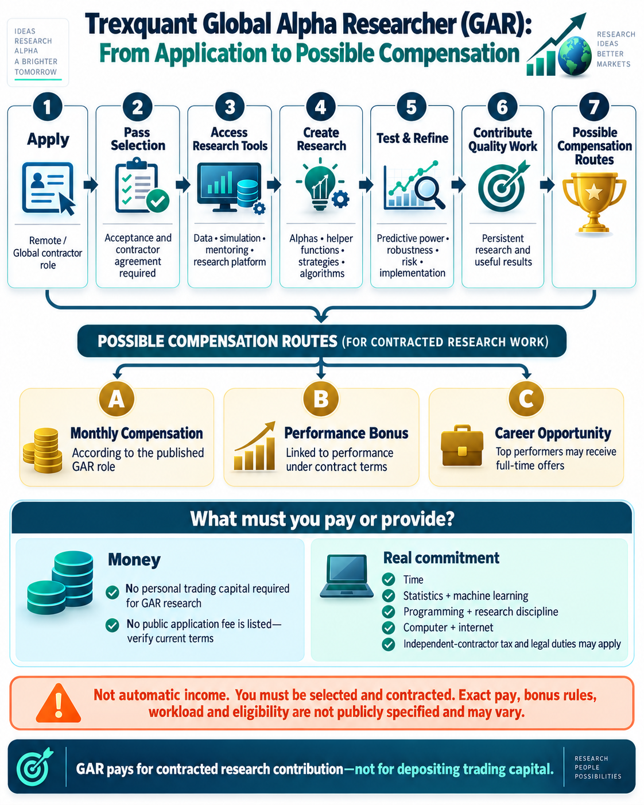

## What is the GAR programme?

The [Trexquant Global Alpha Researcher programme](https://trexquant.com/global-alpha-researcher) is a remote, global independent-contractor opportunity in quantitative research. GARs use Trexquant's data, simulation tools, and research platform to develop alphas, helper functions, strategies, and related algorithms.

An alpha is a predictive signal intended to help estimate future financial-market behaviour. Researchers develop an idea, translate it into a testable model, simulate it on historical data, and refine it after studying performance, risk, robustness, and implementation concerns.

## How can GAR research lead to compensation?

The GAR route is different from opening a personal trading account:

- **Apply and pass selection:** platform access and compensation do not begin automatically. An applicant must be accepted and enter an independent-contractor arrangement.
- **Conduct research:** GAR work may include building alphas, implementing academic ideas, developing algorithms, preparing datasets, and applying machine learning.
- **Monthly compensation and performance bonus:** Trexquant's published GAR vacancy lists monthly compensation plus a performance bonus, but it does not publicly state the amounts or calculation rules.
- **Career opportunity:** Trexquant states that top performers may be considered for full-time offers.
- **No personal trading deposit:** the GAR opportunity concerns contracted research work using Trexquant's platform. It does not require researchers to fund a personal brokerage account for the research.

## What must you afford or provide?

The main commitment is not trading capital. It is the ability to produce useful quantitative research:

- time for sustained research and repeated experimentation;
- knowledge of statistics, mathematics, machine learning, and financial markets;
- programming and data-analysis skills;
- persistence when ideas fail research tests;
- a suitable computer and reliable internet connection; and
- responsibility for any tax, reporting, or legal obligations arising from independent-contractor status.

Trexquant's public GAR materials do not list an application fee. However, applicants should verify all current terms directly with Trexquant before accepting an offer or providing personal information.

## What does a GAR work on?

According to the [published GAR role](https://trexquant.com/careers/64D3F1C8DA), responsibilities can include:

- developing market-neutral, medium-frequency alphas that predict stock returns;
- investigating and implementing academic research;
- developing algorithms to filter and combine alphas;
- preparing datasets for future alpha development; and
- applying machine-learning methods to alpha discovery and portfolio construction.

## Important distinction

GAR compensation is payment for contracted research contribution. It is not an investment return, and a strong backtest does not itself create income. Selection, workload, acceptance of research, monthly compensation, performance bonuses, and future employment depend on Trexquant's evaluation and contract terms.

Information checked on 5 October 2026. See the official [GAR programme page](https://trexquant.com/global-alpha-researcher) and [GAR vacancy](https://trexquant.com/careers/64D3F1C8DA) for current information.
