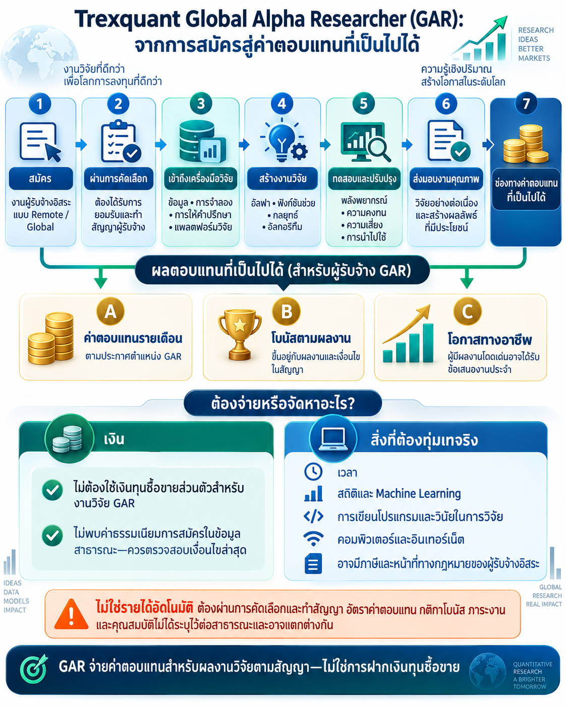

## โครงการ GAR คืออะไร?

[Trexquant Global Alpha Researcher programme](https://trexquant.com/global-alpha-researcher) เป็นโอกาสทำงานวิจัยเชิงปริมาณแบบผู้รับจ้างอิสระจากระยะไกลและเปิดในระดับสากล นักวิจัย GAR ใช้ข้อมูล เครื่องมือจำลอง และแพลตฟอร์มวิจัยของ Trexquant เพื่อพัฒนาอัลฟา ฟังก์ชันช่วย กลยุทธ์ และอัลกอริทึมที่เกี่ยวข้อง

อัลฟาคือสัญญาณพยากรณ์ที่พยายามช่วยประเมินพฤติกรรมของตลาดการเงินในอนาคต นักวิจัยเริ่มจากแนวคิด แปลงเป็นแบบจำลองที่ทดสอบได้ จำลองกับข้อมูลในอดีต และปรับปรุงหลังจากศึกษาผลงาน ความเสี่ยง ความคงทน และข้อจำกัดในการนำไปใช้

## งานวิจัย GAR นำไปสู่ค่าตอบแทนได้อย่างไร?

เส้นทาง GAR แตกต่างจากการเปิดบัญชีซื้อขายส่วนตัว:

- **สมัครและผ่านการคัดเลือก:** การเข้าถึงแพลตฟอร์มและค่าตอบแทนไม่ได้เกิดขึ้นโดยอัตโนมัติ ผู้สมัครต้องได้รับการยอมรับและทำสัญญาในฐานะผู้รับจ้างอิสระ
- **ทำงานวิจัย:** งาน GAR อาจครอบคลุมการสร้างอัลฟา การประยุกต์งานวิชาการ การพัฒนาอัลกอริทึม การเตรียมข้อมูล และการใช้ Machine Learning
- **ค่าตอบแทนรายเดือนและโบนัสตามผลงาน:** ประกาศตำแหน่ง GAR ของ Trexquant ระบุค่าตอบแทนรายเดือนและโบนัสตามผลงาน แต่ไม่ได้เปิดเผยจำนวนเงินหรือวิธีคำนวณต่อสาธารณะ
- **โอกาสทางอาชีพ:** Trexquant ระบุว่าผู้มีผลงานโดดเด่นอาจได้รับการพิจารณาสำหรับงานประจำ
- **ไม่ต้องฝากเงินซื้อขายส่วนตัว:** GAR เป็นงานวิจัยตามสัญญาบนแพลตฟอร์มของ Trexquant จึงไม่ใช่การนำเงินส่วนตัวไปฝากในบัญชีซื้อขายเพื่อทำงานวิจัย

## ต้องมีเงินหรือจัดหาอะไรบ้าง?

สิ่งสำคัญไม่ใช่เงินทุนซื้อขาย แต่คือความสามารถในการสร้างงานวิจัยเชิงปริมาณที่มีประโยชน์:

- เวลาในการวิจัยต่อเนื่องและทดลองซ้ำ
- ความรู้ด้านสถิติ คณิตศาสตร์ Machine Learning และตลาดการเงิน
- ทักษะการเขียนโปรแกรมและการวิเคราะห์ข้อมูล
- ความพยายามอย่างต่อเนื่องเมื่อแนวคิดไม่ผ่านการทดสอบ
- คอมพิวเตอร์ที่เหมาะสมและอินเทอร์เน็ตที่เชื่อถือได้
- ความรับผิดชอบด้านภาษี การรายงาน หรือกฎหมายที่อาจเกิดจากสถานะผู้รับจ้างอิสระ

ข้อมูล GAR ที่เผยแพร่ต่อสาธารณะไม่ระบุค่าธรรมเนียมการสมัคร อย่างไรก็ตาม ผู้สมัครควรตรวจสอบเงื่อนไขล่าสุดกับ Trexquant โดยตรงก่อนยอมรับข้อเสนอหรือให้ข้อมูลส่วนตัว

## GAR ทำงานอะไรบ้าง?

ตาม [ประกาศตำแหน่ง GAR](https://trexquant.com/careers/64D3F1C8DA) ความรับผิดชอบอาจรวมถึง:

- พัฒนาอัลฟาแบบ Market-neutral และ Medium-frequency เพื่อพยากรณ์ผลตอบแทนของหุ้น
- ศึกษาและประยุกต์ผลงานวิจัยทางวิชาการ
- พัฒนาอัลกอริทึมเพื่อคัดกรองและผสมอัลฟา
- เตรียมชุดข้อมูลสำหรับการพัฒนาอัลฟาในอนาคต
- ใช้ Machine Learning ในการค้นหาอัลฟาและการสร้างพอร์ตลงทุน

## ข้อแตกต่างที่สำคัญ

ค่าตอบแทน GAR คือค่าตอบแทนสำหรับผลงานวิจัยตามสัญญา ไม่ใช่ผลตอบแทนจากการลงทุน และผลทดสอบย้อนหลังที่ดีไม่ได้สร้างรายได้ด้วยตัวเอง การคัดเลือก ภาระงาน การยอมรับผลงาน ค่าตอบแทนรายเดือน โบนัสตามผลงาน และโอกาสได้งานในอนาคตขึ้นอยู่กับการประเมินและเงื่อนไขสัญญาของ Trexquant

ข้อมูลตรวจสอบเมื่อวันที่ 5 ตุลาคม 2569 โปรดดูข้อมูลล่าสุดจาก [หน้าโครงการ GAR อย่างเป็นทางการ](https://trexquant.com/global-alpha-researcher) และ [ประกาศตำแหน่ง GAR](https://trexquant.com/careers/64D3F1C8DA)
