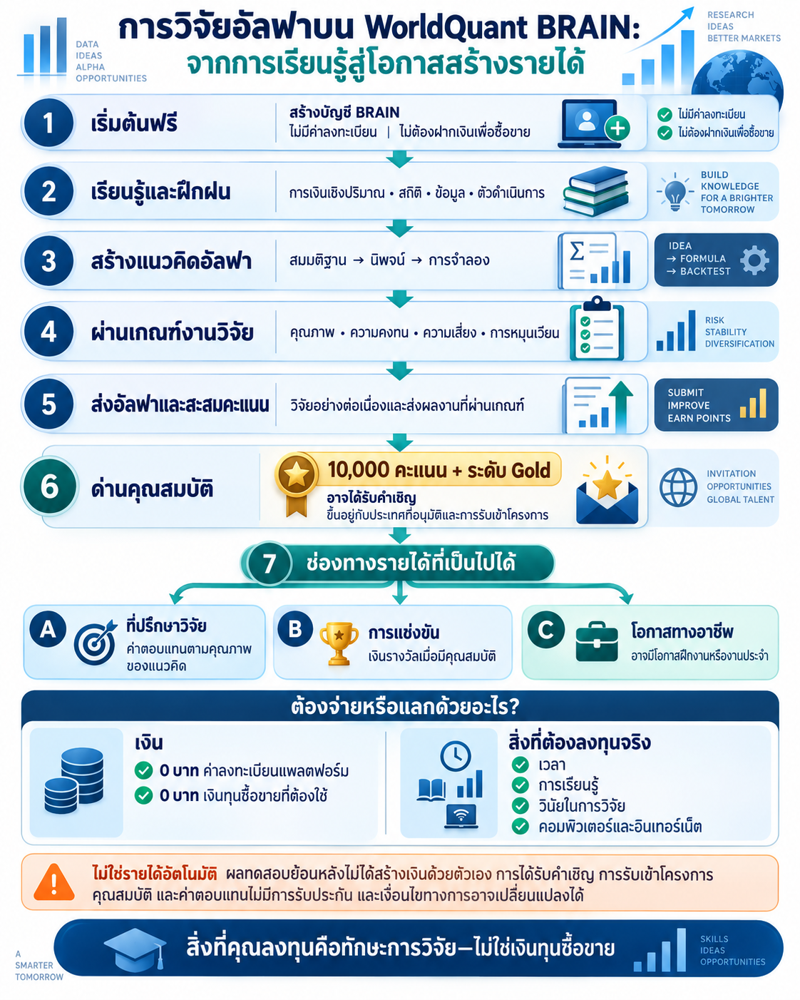

## WorldQuant BRAIN คืออะไร?

[WorldQuant BRAIN](https://www.worldquant.com/brain/) คือแพลตฟอร์มจำลองออนไลน์สำหรับเรียนรู้และฝึกปฏิบัติด้านการเงินเชิงปริมาณ ภายในแพลตฟอร์มมีชุดข้อมูลทางการเงิน ตัวดำเนินการทางคณิตศาสตร์ เครื่องมือวิจัย ระบบจำลอง และแดชบอร์ดผลการทดสอบ เพื่อช่วยเปลี่ยนแนวคิดการลงทุนให้เป็นแบบจำลองที่ตรวจสอบด้วยข้อมูลได้

แพลตฟอร์มนี้เหมาะกับผู้สนใจจากหลายสาขา คุณไม่จำเป็นต้องเริ่มต้นจากการเป็นนักซื้อขายมืออาชีพ ความอยากรู้อยากเห็น การคิดอย่างมีเหตุผล ความรู้สถิติพื้นฐาน และความตั้งใจที่จะทดสอบแนวคิดอย่างรอบคอบ ล้วนเป็นจุดเริ่มต้นที่ดี

## งานวิจัยนำไปสู่รายได้ได้อย่างไร?

แผนภาพนี้แยก **รายได้ที่เป็นไปได้** ออกจาก **สิ่งที่ต้องลงทุน** อย่างชัดเจน:

- **ไม่มีค่าลงทะเบียนแพลตฟอร์ม:** WorldQuant ระบุว่าการสร้างบัญชี BRAIN และการเข้าร่วม International Quant Championship 2026 ไม่มีค่าใช้จ่าย
- **ไม่ต้องฝากเงินเพื่อซื้อขายจริง:** BRAIN เป็นแพลตฟอร์มจำลองและวิจัย เส้นทางนี้จึงไม่ต้องนำเงินส่วนตัวไปฝากในบัญชีซื้อขายจริง
- **สิ่งที่ต้องลงทุน:** เวลา การเรียนรู้ การทดลองซ้ำ วินัยในการวิจัย ตลอดจนคอมพิวเตอร์และอินเทอร์เน็ต
- **เส้นทาง Research Consultant:** การส่งอัลฟาที่ผ่านเกณฑ์จะช่วยสะสมคะแนน ปัจจุบัน WorldQuant ระบุว่าเมื่อมี **10,000 คะแนนและถึงระดับ Gold อาจได้รับคำเชิญ** เข้าสู่ Research Consultant Program ทั้งนี้ขึ้นอยู่กับประเทศ คุณสมบัติ และการผ่านขั้นตอนรับเข้าโครงการ
- **ค่าตอบแทนที่เป็นไปได้:** ผู้ที่ผ่านการรับเข้าเป็น Research Consultant อาจมีโอกาสได้รับค่าตอบแทนตามคุณภาพของแนวคิด แต่ไม่ใช่รายได้อัตโนมัติและไม่มีการรับประกัน
- **ช่องทางอื่น:** การแข่งขันที่ผู้สมัครมีคุณสมบัติอาจมีเงินรางวัล และผลงานที่โดดเด่นอาจนำไปสู่การพิจารณาฝึกงานหรืองานประจำ

เส้นทางและเงื่อนไขเหล่านี้อาจเปลี่ยนแปลงได้ ควรตรวจสอบ [ภาพรวม BRAIN อย่างเป็นทางการ](https://www.worldquant.com/brain/), [Research Consultant Program](https://platform.worldquantbrain.com/consultant-program/) และกติกาการแข่งขันปัจจุบันก่อนตัดสินใจ ข้อมูลตรวจสอบเมื่อวันที่ 5 ตุลาคม 2569

## อัลฟาคืออะไร?

อธิบายอย่างง่าย **อัลฟา (Alpha)** คือกฎทางคณิตศาสตร์ที่พยายามระบุว่าสินทรัพย์ใดอาจมีผลการดำเนินงานในอนาคตดีกว่าหรือแย่กว่าเมื่อเปรียบเทียบกัน

อัลฟาไม่จำเป็นต้องทำนายราคาในอนาคตให้ตรงทุกจุด แต่อาจใช้จัดอันดับสินทรัพย์ เช่น ให้สินทรัพย์ที่มีสัญญาณแข็งแรงกว่าอยู่เหนือสินทรัพย์ที่มีสัญญาณอ่อนกว่า จากนั้นแพลตฟอร์มจะจำลองว่าการจัดอันดับดังกล่าวเคยให้ผลอย่างไรกับข้อมูลในอดีต

> อัลฟาคือสมมติฐานการวิจัยที่เขียนให้อยู่ในรูปแบบซึ่งสามารถทดสอบด้วยข้อมูลได้

## ตัวอย่างแนวคิดอย่างง่าย

สมมติว่านักวิจัยตั้งคำถามว่า:

> “หุ้นของบริษัทที่ข้อมูลทางธุรกิจปรับตัวดีขึ้น มีแนวโน้มให้ผลตอบแทนดีกว่าหุ้นของบริษัทที่ข้อมูลแย่ลงหรือไม่?”

นักวิจัยอาจเลือกข้อมูลที่เหมาะสม แปลงข้อมูลให้เปรียบเทียบกันได้ จัดอันดับหุ้น และนำแนวคิดไปจำลอง ตัวอย่างนี้มีไว้เพื่ออธิบายแนวคิดเท่านั้น ไม่ใช่คำแนะนำการลงทุนหรืออัลฟาที่พร้อมใช้งานจริง งานวิจัยที่สมบูรณ์ยังต้องพิจารณาความเสี่ยง ปริมาณการซื้อขาย ความคงทนของผลลัพธ์ และเหตุผลทางเศรษฐศาสตร์ประกอบด้วย

## ขั้นตอนการวิจัย

1. **เริ่มจากแนวคิด** ตั้งสมมติฐานที่ชัดเจนเกี่ยวกับพฤติกรรมของตลาด
2. **เลือกข้อมูลที่เกี่ยวข้อง** เช่น ข้อมูลตลาด ปัจจัยพื้นฐาน นักวิเคราะห์ ความรู้สึกของตลาด หรือข้อมูลทางเลือก
3. **สร้างนิพจน์** ใช้ตัวดำเนินการทางคณิตศาสตร์เพื่อปรับ แปลง เปรียบเทียบ หรือผสมข้อมูล
4. **รันการจำลอง** ทดสอบนิพจน์กับข้อมูลในอดีตภายใต้เงื่อนไขที่กำหนด
5. **ประเมินหลักฐาน** ตรวจสอบผลตอบแทน ความเสี่ยง อัตราการหมุนเวียน ความเสถียร และตัวชี้วัดอื่น
6. **ปรับปรุงแบบจำลอง** ลดความซับซ้อนที่ไม่จำเป็น และทดสอบในช่วงเวลาหรือกลุ่มสินทรัพย์อื่น
7. **ตรวจสอบความคงทน** พิจารณาว่าผลลัพธ์มาจากแนวคิดที่ทำซ้ำได้ หรือเป็นเพียงความบังเอิญในข้อมูลอดีต

## นักวิจัยจะได้เรียนรู้อะไร?

- การเปลี่ยนความคิดทางการเงินให้เป็นกฎที่ชัดเจนและทดสอบได้
- การทำงานกับข้อมูลทางการเงินจำนวนมากและตัวดำเนินการทางคณิตศาสตร์
- การตีความผลตอบแทน ความเสี่ยง อัตราการหมุนเวียน การขาดทุนสูงสุด และความเสถียร
- เหตุผลที่ควรกระจายความเสี่ยงระหว่างแนวคิดหลายรูปแบบ
- ผลกระทบของการปรับแบบจำลองเข้ากับอดีตมากเกินไป การขุดข้อมูล และต้นทุนธุรกรรม
- การอธิบายเหตุผลทางเศรษฐศาสตร์ที่อยู่เบื้องหลังแบบจำลอง

WorldQuant มีชุดบทเรียน [Learn2Quant](https://www.worldquant.com/learn2quant/) สำหรับผู้เริ่มต้น ครอบคลุมการสร้างแนวคิด การพัฒนาอัลฟา การกระจายความเสี่ยง การบริหารความเสี่ยง และหัวข้อวิจัยขั้นสูง

## ควรตีความผลการจำลองอย่างไร?

ผลการทดสอบย้อนหลังที่ดีเป็นหลักฐานที่ควรศึกษาต่อ แต่ไม่ใช่ข้อพิสูจน์ว่ากลยุทธ์จะประสบความสำเร็จในการซื้อขายจริง ความสัมพันธ์ในอดีตอาจหายไป ข้อมูลอาจมีอคติแฝง และการนำไปใช้จริงอาจมีต้นทุนหรือข้อจำกัดที่ระบบจำลองอย่างง่ายไม่ได้สะท้อนทั้งหมด

ดังนั้น งานวิจัยอัลฟาที่ดีควรให้ความสำคัญกับ:

- สมมติฐานที่ชัดเจนและมีเหตุผลรองรับ
- ผลลัพธ์ที่ยังคงเสถียรภายใต้การทดสอบที่เหมาะสม
- การควบคุมความเสี่ยงและปริมาณการซื้อขาย
- การหลีกเลี่ยงความซับซ้อนที่ไม่จำเป็น
- การแยกผลจากการจำลองออกจากผลการซื้อขายจริงอย่างตรงไปตรงมา

## ใครจะได้รับประโยชน์?

- นักศึกษาที่เริ่มสำรวจการเงินเชิงปริมาณ
- นักวิจัยที่ต้องการฝึกการทดสอบสมมติฐานด้วยข้อมูล
- โปรแกรมเมอร์ที่สนใจการประยุกต์ใช้ความรู้กับตลาดการเงิน
- บุคลากรด้านการเงินที่ต้องการพัฒนาทักษะการวิจัยเชิงระบบ
- ผู้ที่เตรียมตัวเข้าร่วมการแข่งขันหรือโอกาสด้านการวิจัยเชิงปริมาณ

## เป้าหมายของผมบนแพลตฟอร์ม

ผมใช้ WorldQuant BRAIN เป็นสภาพแวดล้อมสำหรับการวิจัยเชิงปริมาณ เพื่อฝึกพัฒนาสมมติฐานอัลฟา ทดสอบอย่างเป็นระบบ ศึกษาลักษณะความเสี่ยง และสร้างวินัยในการแยกสัญญาณที่มีเหตุผลออกจากรูปแบบที่เกิดขึ้นโดยบังเอิญ

สามารถดูใบรับรองระดับ Gold Level ของผมได้ที่หน้า [การซื้อขาย](/pmarupanthorn/th/trading/#trading-achievement)

## หมายเหตุสำคัญ

เนื้อหาหน้านี้จัดทำเพื่อการศึกษา ไม่ใช่คำแนะนำการลงทุน ไม่เปิดเผยนิพจน์อัลฟาที่เป็นกรรมสิทธิ์ และไม่รับรองว่าผลจากการจำลองจะเกิดขึ้นจริงในการซื้อขาย เงื่อนไขการเข้าถึง โปรแกรม คุณสมบัติผู้สมัคร และเกณฑ์การประเมินเป็นไปตามที่ WorldQuant กำหนดและอาจเปลี่ยนแปลงได้ โปรดตรวจสอบข้อมูลล่าสุดจาก [เว็บไซต์ WorldQuant BRAIN อย่างเป็นทางการ](https://www.worldquant.com/brain/)
